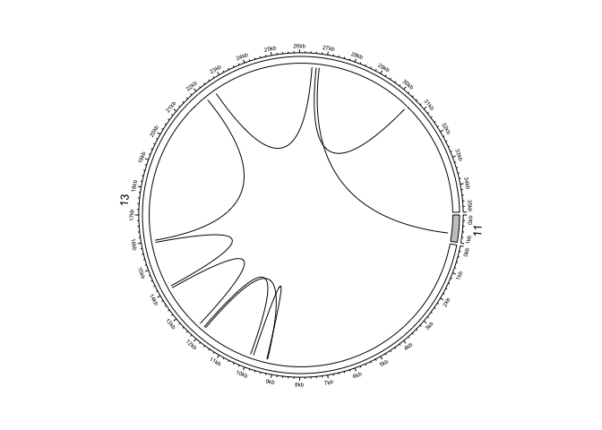

<!-- README.md is generated from README.Rmd. Please do not edit this file directly. -->

# svaRetro: R package for retrotransposed transcript detection from structural variants

<!-- badges: start -->

[](https://www.gnu.org/licenses/gpl-3.0)

<!-- badges: end -->

`svaRetro` contains functions for detecting retrotransposed transcripts
(RTs) from structural variant calls. It takes structural variant calls
in GRanges of breakend notation and identifies RTs by exon-exon
junctions and insertion sites. The candidate RTs are reported by events
and annotated with information of the inserted transcripts.

This package uses a breakend-centric event notation adopted from the
[`StructuralVariantAnnotation`](https://www.bioconductor.org/packages/release/bioc/html/StructuralVariantAnnotation.html)
package. More information about `VCF` objects and breakend-centric
GRanges object can be found by consulting the vignettes in the
corresponding packages with `browseVignettes("VariantAnnotation")` and
`browseVignettes("StructuralVariantAnnotation")`.

# Installation

[svaNUMT](https://doi.org/doi:10.18129/B9.bioc.svaRetro) is currently
available for download in Bioconductor (since BioC 3.14 & R 4.1):

``` r
# install.packages("BiocManager")
BiocManager::install("svaRetro")
```

The development version can be installed from GitHub:

``` r
BiocManager::install("PapenfussLab/svaRetro")
```

# How to cite

If you use svaRetro, please cite `svaRetro`
[here](https://bioconductor.org/packages/svaRetro).

    @article {Dong2021.08.18.456578,
        author = {Dong, Ruining and Cameron, Daniel and Bedo, Justin and Papenfuss, Anthony T},
        title = {svaRetro and svaNUMT: Modular packages for annotation of retrotransposed transcripts and nuclear integration of mitochondrial DNA in genome sequencing data},
        elocation-id = {2021.08.18.456578},
        year = {2021},
        doi = {10.1101/2021.08.18.456578},
        publisher = {Cold Spring Harbor Laboratory},
        abstract = {Background The biological significance of structural variation is now more widely recognized. However, due to the lack of available tools for downstream analysis, including processing and annotating, interpretation of structural variant calls remains a challenge.Findings Here we present svaRetro and svaNUMT, R packages that provide functions for annotating novel genomic events such as non-reference retro-copied transcripts and nuclear integration of mitochondrial DNA. We evaluate the performance of these packages to detect events using simulations and public benchmarking datasets, and annotate processed transcripts in a public structural variant database.Conclusions svaRetro and svaNUMT provide efficient, modular tools for downstream identification and annotation of structural variant calls.Competing Interest StatementThe authors have declared no competing interest.SVstructural variantNUMTnuclear mitochondrial integrationRTretroposed transcriptTSDtarget site duplicationmtDNAmitochondrial DNA},
        URL = {https://www.biorxiv.org/content/early/2021/08/19/2021.08.18.456578},
        eprint = {https://www.biorxiv.org/content/early/2021/08/19/2021.08.18.456578.full.pdf},
        journal = {bioRxiv}
    }

# Workflow

Below is a workflow example for detecting RTs from a human SV callset.
This example is taken from the vignette of `svaRetro`.

``` r
library(StructuralVariantAnnotation)
library(VariantAnnotation)
library(svaRetro)

RT_vcf <- readVcf(system.file("extdata", "diploidSV.vcf", package = "svaRetro"))
```

``` r
RT_gr <- StructuralVariantAnnotation::breakpointRanges(RT_vcf, nominalPosition=TRUE)
head(RT_gr)
#> GRanges object with 6 ranges and 13 metadata columns:
#>                                seqnames    ranges strand | paramRangeID                    REF                    ALT      QUAL      FILTER               sourceId                partner      svtype     svLen                 insSeq    insLen       event    HOMLEN
#>                                   <Rle> <IRanges>  <Rle> |     <factor>            <character>            <character> <numeric> <character>            <character>            <character> <character> <numeric>            <character> <numeric> <character> <numeric>
#>   MantaINS:0:775:775:0:1:0_bp1        1     66365      + |           NA         AATATAATATATAA ATATATATATTATTATATAA..       999    MaxDepth MantaINS:0:775:775:0.. MantaINS:0:775:775:0..         INS       129 TATATATATTATTATATAAT..       142        <NA>         0
#>      MantaINS:35:0:0:0:0:0_bp1        1   1004204      + |           NA                      G GGCCACGCGGGCTGTGCAGA..       999        PASS  MantaINS:35:0:0:0:0:0 MantaINS:35:0:0:0:0:..         INS        78 GCCACGCGGGCTGTGCAGAT..        78        <NA>        10
#>      MantaDEL:92:0:0:0:0:0_bp1        1   1161716      + |           NA CCTGTACGGTCAGGAGGAAA..                     CT       999        PASS  MantaDEL:92:0:0:0:0:0 MantaDEL:92:0:0:0:0:..         DEL       -63                      T         1        <NA>         0
#>     MantaDEL:127:0:0:0:0:0_bp1        1   1162672      + |           NA GGCGGGAAGGCGAGCTCGTG..                      G       440        PASS MantaDEL:127:0:0:0:0:0 MantaDEL:127:0:0:0:0..         DEL      -174                                0        <NA>         9
#>     MantaDEL:130:0:0:0:0:0_bp1        1   1183434      + |           NA CAGGCTGGATCTCCAACTCT..                      C       643        PASS MantaDEL:130:0:0:0:0:0 MantaDEL:130:0:0:0:0..         DEL      -263                                0        <NA>         7
#>     MantaDEL:107:0:0:0:1:0_bp1        1   1302326      + |           NA GAATGAGTGGATTGGTGAGT..             GCAGTGTGAA       999        PASS MantaDEL:107:0:0:0:1:0 MantaDEL:107:0:0:0:1..         DEL      -197              CAGTGTGAA         9        <NA>         0
#>   -------
#>   seqinfo: 25 sequences from an unspecified genome
```

Note that `StructuralVariantAnnotation` requires the `GRanges` object to
be composed entirely of valid breakpoints. Please consult the vignette
of the `StructuralVariantAnnotation` package for ensuring breakpoint
consistency.

### Identifying Retrotransposed Transcripts

The package provides `rtDetect` to identify RTs using the provided SV
calls. This is achieved by detecting intronic deletions, which are
breakpoints at exon-intron (and intron-exon) boundaries of a transcript.
Fusions consisting of an exon boundary and a second genomic location are
reported as potential insertion sites. Due to the complexity of RT
events, insertion sites can be discovered on both left and right sides,
only one side, or none at all.

``` r
library(TxDb.Hsapiens.UCSC.hg19.knownGene)
#> Loading required package: GenomicFeatures
#> Loading required package: AnnotationDbi
library(dplyr)
#> 
#> Attaching package: 'dplyr'
#> The following object is masked from 'package:AnnotationDbi':
#> 
#>     select
#> The following object is masked from 'package:VariantAnnotation':
#> 
#>     select
#> The following objects are masked from 'package:Biostrings':
#> 
#>     collapse, intersect, setdiff, setequal, union
#> The following object is masked from 'package:XVector':
#> 
#>     slice
#> The following object is masked from 'package:Biobase':
#> 
#>     combine
#> The following object is masked from 'package:matrixStats':
#> 
#>     count
#> The following objects are masked from 'package:GenomicRanges':
#> 
#>     intersect, setdiff, union
#> The following object is masked from 'package:GenomeInfoDb':
#> 
#>     intersect
#> The following objects are masked from 'package:IRanges':
#> 
#>     collapse, desc, intersect, setdiff, slice, union
#> The following objects are masked from 'package:S4Vectors':
#> 
#>     first, intersect, rename, setdiff, setequal, union
#> The following objects are masked from 'package:BiocGenerics':
#> 
#>     combine, intersect, setdiff, union
#> The following objects are masked from 'package:stats':
#> 
#>     filter, lag
#> The following objects are masked from 'package:base':
#> 
#>     intersect, setdiff, setequal, union
hg19.genes <- TxDb.Hsapiens.UCSC.hg19.knownGene
RT_vcf <- readVcf(system.file("extdata", "diploidSV.vcf", package = "svaRetro"))
RT_gr <- StructuralVariantAnnotation::breakpointRanges(RT_vcf, nominalPosition=TRUE)
RT <- rtDetect(RT_gr, hg19.genes, maxgap=50, minscore=0.3)
#> Warning in (function (seqlevels, genome, new_style) : cannot switch some of hg19's seqlevels from UCSC to NCBI style
#> Warning in .Seqinfo.mergexy(x, y): Each of the 2 combined objects has sequence levels not in the other:
#>   - in 'x': MT
#>   - in 'y': chrM, HSCHR1_RANDOM_CTG5, HSCHR1_RANDOM_CTG12, HSCHR4_1_CTG9, HSCHR4_RANDOM_CTG2, HSCHR4_RANDOM_CTG3, HSCHR6_MHC_APD_CTG1, HSCHR6_MHC_COX_CTG1, HSCHR6_MHC_DBB_CTG1, HSCHR6_MHC_MANN_CTG1, HSCHR6_MHC_MCF_CTG1, HSCHR6_MHC_QBL_CTG1, HSCHR6_MHC_SSTO_CTG1, HSCHR7_RANDOM_CTG1, HSCHR8_RANDOM_CTG1, HSCHR8_RANDOM_CTG4, HSCHR9_RANDOM_CTG1, HSCHR9_RANDOM_CTG2, HSCHR9_RANDOM_CTG4, HSCHR9_RANDOM_CTG5, HSCHR11_RANDOM_CTG2, HSCHR17_1_CTG5, HSCHR17_RANDOM_CTG1, HSCHR17_RANDOM_CTG2, HSCHR17_RANDOM_CTG3, HSCHR17_RANDOM_CTG4, HSCHR18_RANDOM_CTG1, HSCHR19_RANDOM_CTG1, HSCHR19_RANDOM_CTG2, HSCHR21_RANDOM_CTG9, HSCHRUN_RANDOM_CTG1, HSCHRUN_RANDOM_CTG2, HSCHRUN_RANDOM_CTG3, HSCHRUN_RANDOM_CTG4, HSCHRUN_RANDOM_CTG5, HSCHRUN_RANDOM_CTG6, HSCHRUN_RANDOM_CTG7, HSCHRUN_RANDOM_CTG9, HSCHRUN_RANDOM_CTG10, HSCHRUN_RANDOM_CTG11, HSCHRUN_RANDOM_CTG13, HSCHRUN_RANDOM_CTG14, HSCHRUN_RANDOM_CTG15, HSCHRUN_RANDOM_CTG16, HSCHRUN_RANDOM_CTG17, HSCHRUN_RANDOM_CTG19, HSCHRUN_RANDOM_CTG20, HSCHRUN_RANDOM_CTG21, HSCHRUN_RANDOM_CTG22, HSCHRUN_RANDOM_CTG23, HSCHRUN_RANDOM_CTG24, HSCHRUN_RANDOM_CTG25, HSCHRUN_RANDOM_CTG26, HSCHRUN_RANDOM_CTG27, HSCHRUN_RANDOM_CTG28, HSCHRUN_RANDOM_CTG29, HSCHRUN_RANDOM_CTG30, HSCHRUN_RANDOM_CTG31, HSCHRUN_RANDOM_CTG32, HSCHRUN_RANDOM_CTG33, HSCHRUN_RANDOM_CTG34, HSCHRUN_RANDOM_CTG35, HSCHRUN_RANDOM_CTG36, HSCHRUN_RANDOM_CTG37, HSCHRUN_RANDOM_CTG38, HSCHRUN_RANDOM_CTG39, HSCHRUN_RANDOM_CTG40, HSCHRUN_RANDOM_CTG41, HSCHRUN_RANDOM_CTG42
#>   Make sure to always combine/compare objects based on the same reference
#>   genome (use suppressWarnings() to suppress this warning).

#> Warning in .Seqinfo.mergexy(x, y): Each of the 2 combined objects has sequence levels not in the other:
#>   - in 'x': MT
#>   - in 'y': chrM, HSCHR1_RANDOM_CTG5, HSCHR1_RANDOM_CTG12, HSCHR4_1_CTG9, HSCHR4_RANDOM_CTG2, HSCHR4_RANDOM_CTG3, HSCHR6_MHC_APD_CTG1, HSCHR6_MHC_COX_CTG1, HSCHR6_MHC_DBB_CTG1, HSCHR6_MHC_MANN_CTG1, HSCHR6_MHC_MCF_CTG1, HSCHR6_MHC_QBL_CTG1, HSCHR6_MHC_SSTO_CTG1, HSCHR7_RANDOM_CTG1, HSCHR8_RANDOM_CTG1, HSCHR8_RANDOM_CTG4, HSCHR9_RANDOM_CTG1, HSCHR9_RANDOM_CTG2, HSCHR9_RANDOM_CTG4, HSCHR9_RANDOM_CTG5, HSCHR11_RANDOM_CTG2, HSCHR17_1_CTG5, HSCHR17_RANDOM_CTG1, HSCHR17_RANDOM_CTG2, HSCHR17_RANDOM_CTG3, HSCHR17_RANDOM_CTG4, HSCHR18_RANDOM_CTG1, HSCHR19_RANDOM_CTG1, HSCHR19_RANDOM_CTG2, HSCHR21_RANDOM_CTG9, HSCHRUN_RANDOM_CTG1, HSCHRUN_RANDOM_CTG2, HSCHRUN_RANDOM_CTG3, HSCHRUN_RANDOM_CTG4, HSCHRUN_RANDOM_CTG5, HSCHRUN_RANDOM_CTG6, HSCHRUN_RANDOM_CTG7, HSCHRUN_RANDOM_CTG9, HSCHRUN_RANDOM_CTG10, HSCHRUN_RANDOM_CTG11, HSCHRUN_RANDOM_CTG13, HSCHRUN_RANDOM_CTG14, HSCHRUN_RANDOM_CTG15, HSCHRUN_RANDOM_CTG16, HSCHRUN_RANDOM_CTG17, HSCHRUN_RANDOM_CTG19, HSCHRUN_RANDOM_CTG20, HSCHRUN_RANDOM_CTG21, HSCHRUN_RANDOM_CTG22, HSCHRUN_RANDOM_CTG23, HSCHRUN_RANDOM_CTG24, HSCHRUN_RANDOM_CTG25, HSCHRUN_RANDOM_CTG26, HSCHRUN_RANDOM_CTG27, HSCHRUN_RANDOM_CTG28, HSCHRUN_RANDOM_CTG29, HSCHRUN_RANDOM_CTG30, HSCHRUN_RANDOM_CTG31, HSCHRUN_RANDOM_CTG32, HSCHRUN_RANDOM_CTG33, HSCHRUN_RANDOM_CTG34, HSCHRUN_RANDOM_CTG35, HSCHRUN_RANDOM_CTG36, HSCHRUN_RANDOM_CTG37, HSCHRUN_RANDOM_CTG38, HSCHRUN_RANDOM_CTG39, HSCHRUN_RANDOM_CTG40, HSCHRUN_RANDOM_CTG41, HSCHRUN_RANDOM_CTG42
#>   Make sure to always combine/compare objects based on the same reference
#>   genome (use suppressWarnings() to suppress this warning).
```

The output is a list of `GRanges` object consisting of two sets of
`GRanges` calls, `insSite` and `junctions`, containing candidate
insertion sites and exon-exon junctions respectively. Candidate
insertion sites are annotated by the source transcripts and whether
exon-exon junctions are detected for the source transcripts. RT junction
breakends are annotated by the UCSC exon IDs, corresponding transcripts,
and NCBI gene symbols.

``` r
RT$SKA3
#> $junctions
#> GRanges object with 14 ranges and 17 metadata columns:
#>                                  seqnames    ranges strand | paramRangeID                    REF         ALT      QUAL      FILTER               sourceId                partner      svtype     svLen      insSeq    insLen       event    HOMLEN      exon                              txs  exons gene_symbol
#>                                     <Rle> <IRanges>  <Rle> |     <factor>            <character> <character> <numeric> <character>            <character>            <character> <character> <numeric> <character> <numeric> <character> <numeric> <integer>                           <list> <list>      <list>
#>    MantaDEL:245251:6:6:0:0:0_bp2       13  21729832      - |           NA TCTGCAACAGATACAAATAA..           T       999        PASS MantaDEL:245251:6:6:.. MantaDEL:245251:6:6:..         DEL      -542                     0        <NA>         1    176912            uc001unt.3,uc001unv.3 176912        SKA3
#>    MantaDEL:245251:5:8:0:0:0_bp2       13  21732061      - |           NA                      G       <DEL>       999        PASS MantaDEL:245251:5:8:.. MantaDEL:245251:5:8:..         DEL     -2110        <NA>         0        <NA>         2    176913            uc001unt.3,uc001unv.3 176913        SKA3
#>    MantaDEL:245251:5:9:0:0:0_bp2       13  21734038      - |           NA                      A       <DEL>       525        PASS MantaDEL:245251:5:9:.. MantaDEL:245251:5:9:..         DEL     -1776        <NA>         0        <NA>         4    176914 uc001unt.3,uc001unu.3,uc001unv.3 176914        SKA3
#>   MantaDEL:245251:7:10:0:0:0_bp2       13  21735929      - |           NA                      T       <DEL>       539        PASS MantaDEL:245251:7:10.. MantaDEL:245251:7:10..         DEL     -1802        <NA>         0        <NA>         1    176915 uc001unt.3,uc001unu.3,uc001unv.3 176915        SKA3
#>   MantaDEL:245251:4:11:0:0:0_bp2       13  21742127      - |           NA                      A       <DEL>       999        PASS MantaDEL:245251:4:11.. MantaDEL:245251:4:11..         DEL     -6112        <NA>         0        <NA>         2    176916 uc001unt.3,uc001unu.3,uc001unv.3 176916        SKA3
#>                              ...      ...       ...    ... .          ...                    ...         ...       ...         ...                    ...                    ...         ...       ...         ...       ...         ...       ...       ...                              ...    ...         ...
#>    MantaDEL:245251:5:9:0:0:0_bp1       13  21732261      + |           NA                      A       <DEL>       525        PASS MantaDEL:245251:5:9:.. MantaDEL:245251:5:9:..         DEL     -1776        <NA>         0        <NA>         4    176913 uc001unt.3,uc001unu.3,uc001unv.3 176913        SKA3
#>   MantaDEL:245251:7:10:0:0:0_bp1       13  21734126      + |           NA                      T       <DEL>       539        PASS MantaDEL:245251:7:10.. MantaDEL:245251:7:10..         DEL     -1802        <NA>         0        <NA>         1    176914 uc001unt.3,uc001unu.3,uc001unv.3 176914        SKA3
#>   MantaDEL:245251:4:11:0:0:0_bp1       13  21736014      + |           NA                      A       <DEL>       999        PASS MantaDEL:245251:4:11.. MantaDEL:245251:4:11..         DEL     -6112        <NA>         0        <NA>         2    176915 uc001unt.3,uc001unu.3,uc001unv.3 176915        SKA3
#>    MantaDEL:245251:3:4:0:0:0_bp1       13  21742538      + |           NA                      A       <DEL>       999        PASS MantaDEL:245251:3:4:.. MantaDEL:245251:3:4:..         DEL     -3939        <NA>         0        <NA>         2    176916 uc001unt.3,uc001unu.3,uc001unv.3 176916        SKA3
#>    MantaDEL:245251:2:3:0:0:0_bp1       13  21746642      + |           NA                      T       <DEL>       999        PASS MantaDEL:245251:2:3:.. MantaDEL:245251:2:3:..         DEL     -3870        <NA>         0        <NA>         2    176917 uc001unt.3,uc001unu.3,uc001unv.3 176917        SKA3
#>   -------
#>   seqinfo: 25 sequences from an unspecified genome
#> 
#> $insSite
#> GRanges object with 4 ranges and 18 metadata columns:
#>                                 seqnames    ranges strand | paramRangeID         REF             ALT      QUAL      FILTER               sourceId                partner      svtype     svLen      insSeq    insLen       event    HOMLEN  exons                              txs        rtFound rtFoundSum gene_symbol
#>                                    <Rle> <IRanges>  <Rle> |     <factor> <character>     <character> <numeric> <character>            <character>            <character> <character> <numeric> <character> <numeric> <character> <numeric> <list>                           <list>         <list>  <logical>      <list>
#>     MantaBND:245251:0:3:0:0:0:0       13  21746762      + |           NA           T T[11:108585702[        49        PASS MantaBND:245251:0:3:.. MantaBND:245251:0:3:..         BND        NA                     0        <NA>         0 176918            uc001unt.3,uc001unu.3      TRUE,TRUE       TRUE        SKA3
#>   MantaDEL:245251:5:6:0:0:0_bp2       13  21731995      - |           NA           T           <DEL>       283        PASS MantaDEL:245251:5:6:.. MantaDEL:245251:5:6:..         DEL     -2734        <NA>         0        <NA>         0 176911 uc001unt.3,uc001unu.3,uc001unv.3 TRUE,TRUE,TRUE       TRUE        SKA3
#>     MantaBND:245251:0:3:0:0:0:1       11 108585702      - |           NA           T  ]13:21746762]T        49        PASS MantaBND:245251:0:3:.. MantaBND:245251:0:3:..         BND        NA                     0        <NA>         0   <NA>                             <NA>           <NA>       <NA>        <NA>
#>   MantaDEL:245251:5:6:0:0:0_bp1       13  21729260      + |           NA           T           <DEL>       283        PASS MantaDEL:245251:5:6:.. MantaDEL:245251:5:6:..         DEL     -2734        <NA>         0        <NA>         0   <NA>                             <NA>           <NA>       <NA>        <NA>
#>   -------
#>   seqinfo: 25 sequences from an unspecified genome
```

## Visualising breakpoint pairs via circos plots

One way of visualising RT is by circos plots. Here we use the package
[`circlize`](https://doi.org/10.1093/bioinformatics/btu393) to
demonstrate the visualisation of insertion site and exon-exon junctions.

To generate a simple circos plot of RT event with SKA3 transcript:

``` r
library(circlize)
rt_chr_prefix <- c(RT$SKA3$junctions, RT$SKA3$insSite)
seqlevelsStyle(rt_chr_prefix) <- "UCSC"
pairs <- breakpointgr2pairs(rt_chr_prefix)
pairs
```

To see supporting breakpoints clearly, we generate the circos plot
according to the loci of event.

``` r
circos.initializeWithIdeogram(
    data.frame(V1=c("chr13", "chr11"),
               V2=c(21720000,108585000),
               V3=c(21755000,108586000),
               V4=c("q12.11","q24.3"),
               V5=c("gneg","gpos50")))
circos.genomicLink(as.data.frame(S4Vectors::first(pairs)), as.data.frame(S4Vectors::second(pairs)))
```

<!-- -->

``` r
circos.clear()
```

<!-- # Citation

You can cite `svaNUMT` [here]()

```
@ARTICLE{svaNUMT,
  title    = "",
  author   = "",
  journal  = "",
  volume   = ,
  number   = ,
  pages    = ,
  month    = ,
  year     = ,
  url      = ,
  doi      = ,
  pmc      = 
}
```
-->
